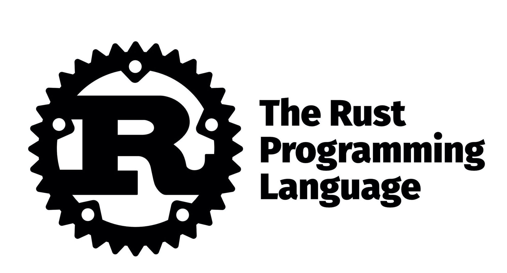

Curated collection of resources to make games on Rust.

### Game Engines and Renderers

- [WebGPU - State of the art API for rendering](https://github.com/gfx-rs/wgpu) ( project )
- [Bevy - webgpu based game engine](https://github.com/bevyengine/bevy) ( project )
- [Piston - the oldest game engine](https://github.com/PistonDevelopers/piston) ( project )
- [RG3D](https://github.com/rg3dengine/rg3d) ( project )
- [macroquad - cross platform game engine](https://github.com/not-fl3/macroquad) ( project )
- [Amethyst](https://github.com/amethyst/amethyst) ( project )
