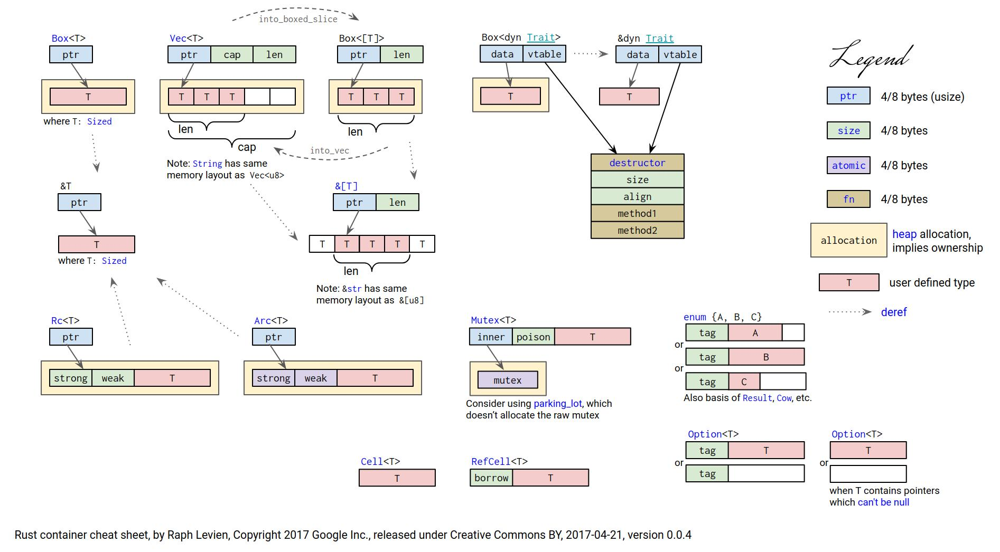

# :chart_with_upwards_trend: Шпаргалки

Колекція шпаргалок.

## Шпаргалки

- [Шпаргалка з мови Rust](https://cheats.rs/) від [Ральфа Бідерта](https://xr.io/)
- [Розмітка пам'яті](./cheat_sheets_ua.md#розмітка-памяті) від Рафа Левіна
- [Шпаргалка](https://github.com/donbright/rust-lang-cheat-sheet) від [don bright](https://github.com/donbright) : основи

## Розмітка пам'яті

