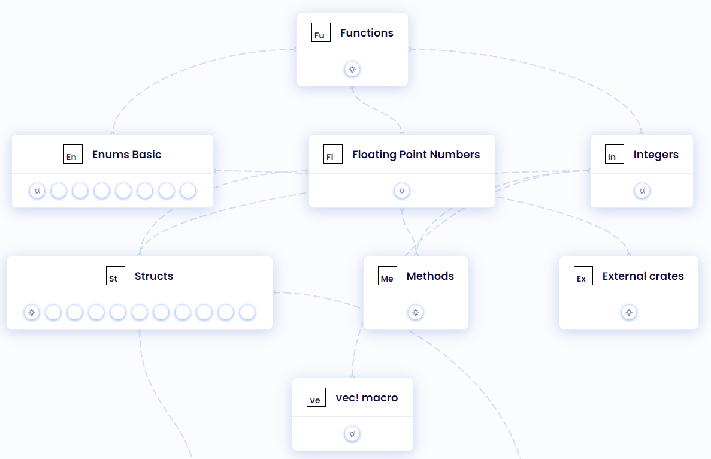

# :footprints:️ Вступ

Це покрокова інструкція з налаштування та мета для початку розробки в Rust.

## :crab: Що це?

<!--  -->

Rust - це багатопарадигмальна мова програмування, створена для забезпечення продуктивності та безпеки. Це ефективний інструмент для співпраці великих команд розробників з різним рівнем знань. Крім того, згідно з опитуванняи розробників Stack Overflow, Rust є найулюбленішою мовою програмування протягом семи років поспіль. Спільнота Rust традиційно дуже дружня.

## :book: Ресурси для використання:

Є кілька найпопулярніших офіційних ресурсів загального призначення для вивчення Rust:

- [The Rust Book](https://doc.rust-lang.org/book/ch00-00-introduction.html) [:ukraine:](https://rustlangua.github.io/rustbookua.github.io/) [:uk:](https://doc.rust-lang.org/book/ch00-00-introduction.html)

Можливо, вам буде зручніше почати з відеокурсу, а не з книги. Наприклад, вам може сподобатись [Learn Rust Programming](https://www.youtube.com/watch?v=BpPEoZW5IiY).

:zap: Інші цікаві джерела ви можете знайти в нашій [чудовій колекції матеріалів](./learn_ua.md).

## [:gear: Як налаштувати Rust](rust_setup_ua.md)

## :question: Де отримати допомогу?:

Якщо ви українець, найкращий спосіб отримати допомогу - приєднатися до нашої спільноти [Українська Rust Спільнота](https://t.me/rustlang_ua), де вас точно почують і допоможуть більш досвідчені учасники.

:zap:	Існує також наша сторінка [Спільнота](./communicate_ua.md), де ви можете знайти багато різних глобальних і локальних чатів і потоків новин Rust.

## :pushpin: Як задати питання?

Найкращий спосіб поставити питання - поділитися своїм кодом в [playground](https://play.rust-lang.org/). У цьому випадку іншим учасникам не доведеться витрачати додатковий час на відтворення проблеми.

## :books: Альтернативні способи опанування Rust

**1) Практичні вправи, інтерактивний зворотній зв'язок**

- [Rustlings](https://github.com/rust-lang/rustlings) це проект із невеликими вправами, які допоможуть вам звикнути читати та писати код на Rust. Загалом, ви повинні вирішувати повідомлення компілятора про помилки, змінюючи поданий код. Це дійсно допоможе вам зрозуміти, як працює компілятор і які найпоширеніші проблеми з кодом. Якщо вам важко почати, просто виконайте ці кроки.
- [Rust by practice](https://practice.rs/why-exercise.html) вправи, схожі на rustlings.
- [Exercism](https://exercism.org/tracks/rust) - платформа вільного програмування з відкритим вихідним кодом, яка пропонує вам не лише практику програмування, але й наставництво. Тут ви можете знайти 103 вправи з програмування, які покращать ваше розуміння концепцій Rust. Рекомендовано брати після rustlings.

- [Take your first steps with Rust](https://docs.microsoft.com/en-us/learn/paths/rust-first-steps/) - інтерактивний курс. Закладіть фундамент знань, необхідних для створення швидких і ефективних програм у Rust.

**2) Читання книг**

Якщо ви новачок у своєму дослідженні Rust, ми настійно рекомендуємо вам почати з [книг загального призначення.](./learn_ua.md#основна-документація)  
Потім ви також можете перейти до офіційної книги [Rust Book](https://doc.rust-lang.org/book/), де ви можете знайти всю необхідну інформацію про Rust, або придбати [Programming Rust](https://rozetka.com.ua/ua/search/?text=programming+rust), обидві книги є одними з найпоширеніших. Крім того, якщо ви націлюєтесь на веб-серверну розробку, вам слід прочитати [Zero To Production](https://www.zero2prod.com/index.html?country=Ukraine&discount_code=EEU60), також доступну як [серія статей](https://github.com/rust-lang-ua/learn_rust_together/blob/master/learn/backend_book.md).

:zap:	Інші цікаві книги ви можете знайти в нашій [чудовій колекції матеріалів](./learn_ua.md#mortar_board-наша-чудова-колекція-матеріалів-для-вивчення-rust).

**3) Перегляд відео**

Якщо ви новачок і просто хочете дізнатися, що таке Rust - подивіться [Rust in 100 seconds](https://www.youtube.com/watch?v=5C_HPTJg5ek).  
Щоб зануритися в основи Rust, пройдіть прискорений курс [Crash Course](https://www.youtube.com/watch?v=zF34dRivLOw).  
Щоб глибше вивчити синтаксис Rust і познайомитися з кодом Rust, ми також рекомендуємо вам такі курси, як:

- [Intro to Rust](https://www.youtube.com/playlist?list=PLJbE2Yu2zumDF6BX6_RdPisRVHgzV02NW) by [Tensor Programming](https://www.youtube.com/c/TensorProgramming)
- [Rust Tutorial](https://www.youtube.com/playlist?list=PLLqEtX6ql2EyPAZ1M2_C0GgVd4A-_L4_5) by [Doug Milford](https://www.youtube.com/channel/UCmBgC0JN41HjyjAXfkdkp-Q)
- [Complete Course](https://www.youtube.com/watch?v=BpPEoZW5IiY) by [freeCodeCamp](https://www.youtube.com/@freecodecamp)
- [The Rust Lang Book](https://www.youtube.com/playlist?list=PLai5B987bZ9CoVR-QEIN9foz4QCJ0H2Y8) by [Let's Get Rusty](https://www.youtube.com/c/LetsGetRusty)

:zap: Більше відеокурсів ви можете знайти в нашій [чудовій колекції для вивчення Rust](./learn_ua.md#перший-тиждень)

**4) Використання шпаргалок**

Ще один спосіб освоїти Rust, але через схеми, таблиці та зображення - [Rust Cheat Sheet](https://cheats.rs/). Усі поради, зібрані на одній великій сторінці, завжди стануть у пригоді під час написання коду. Перейдіть до нашої [колекції шпаргалок](./cheat_sheets_ua.md#chart_with_upwards_trend-шпаргалки).

