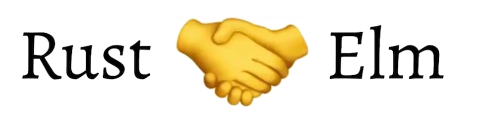

# Rust + Elm

Do you know that Rust and Elm have a lot in common?

- They both have strong support of the functional paradigm.
- They both are static typed.
- They both have sophisticated type systems.
- They both do not have `any` type as TypeScript does.
- They both do not have `null`.
- They both are immutable by default.
- Programs on both of them are usually shorter than on other programming languages.
- Maintaining programs on both of them is usually cheaper.

Is Rust+Elm future of front-end?

- [More on that](https://youtube.com/playlist?list=PLI7Ebs6ANCjtnsXkxFJsUO1U3o3goVd6j)
- [Rust + Elm](https://www.youtube.com/playlist?list=PLI7Ebs6ANCju0IPc3_nB_zQVJqDIibUbo)

#frontend #elm #rustlang #future
